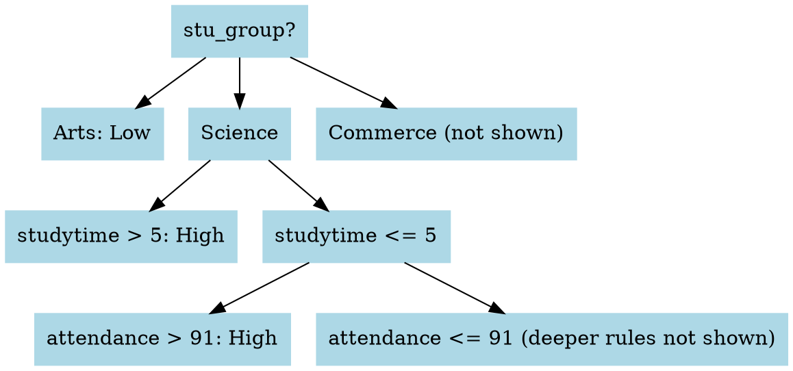
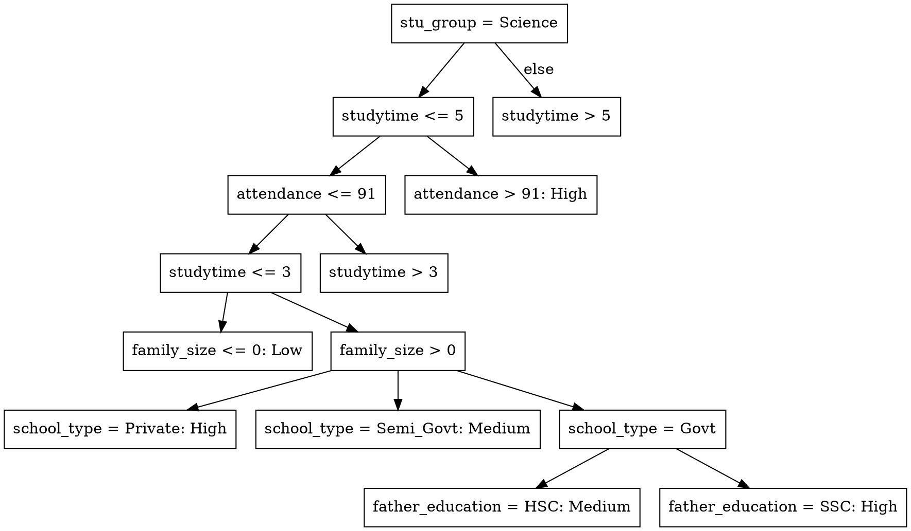

# I. INTRODUCTION
Understanding the multifactorial influences on student academic performance has become increasingly important in the context of data-driven educational research. While innate ability plays a role, numerous studies highlight the substantial impact of external factors such as socioeconomic status, parental education, school type, and access to learning resources on academic outcomes [1], [2]. These influences are particularly critical in developing countries, where systemic disparities often limit educational opportunities [3].
This study presents a multivariate analysis of socioeconomic and educational factors influencing student performance in Bangladesh. Using a structured dataset containing variables such as parental occupation and education, family size, school type, internet access, study time, attendance, tutoring, and participation in extracurricular activities, we aim to identify the most significant predictors of academic success. Performance is measured through scores in core academic subjects—English, Mathematics, Science, Social Science—and Art & Culture.
The study adopts a data-driven approach, leveraging multivariate statistical techniques to uncover patterns and correlations that traditional univariate methods may overlook. This aligns with the growing emphasis on educational data mining and learning analytics in recent literature [4], [5]. The results are expected to provide insights that inform targeted interventions and support evidence-based policymaking in educational settings, especially in low- and middle-income countries.

# II. Objectives
The primary objective of this study is to examine how socioeconomic and educational factors collectively influence student performance in the context of secondary education in Bangladesh. The research aims to explore the extent to which variables such as parental education and employment, family size, and geographic location (urban vs. rural) contribute to academic outcomes. In addition, the study investigates the impact of educational inputs, including school type, study time, internet access, tutoring, attendance, and extracurricular engagement on students' subject-specific performance across English, Mathematics, Science, Social Science, and Art & Culture.
To achieve these aims, the study employs multivariate statistical techniques to analyze the interactions between these variables and to identify the most significant predictors of student success. By leveraging a data-driven approach, the research seeks to provide empirical insights that can support evidence-based decision-making in educational policy and intervention strategies. Ultimately, the study contributes to the growing field of educational data analytics by demonstrating how multivariate analysis can be applied to real-world datasets to uncover patterns and inform educational development initiatives.


# III Methodology and Results (Full KDD-Based Rewrite)

This document presents the complete methodology and results based on the Knowledge Discovery in Databases (KDD) process, incorporating all the steps, decisions, tools, and challenges encountered. The project explores student performance classification using decision trees (J48) and association rule mining (Apriori) in WEKA.

---

## 📌 Tools Used

* **Microsoft Excel** — for data cleaning, feature creation, and category encoding
* **WEKA v3.8.6** — for building and evaluating models (J48 and Apriori)
* **WebGraphviz** — for visualizing decision trees in DOT format

---

## 🔄 KDD Process Steps

### 🔹 1. Selection (Data Collection)

**Goal:** Identify and extract relevant data sources and define the variables needed to analyze student performance.

The dataset used is titled (Insert Title from your source), originally sourced from (Insert Source Link). It contains academic and background information for students from various regions in Bangladesh. It includes **24 attributes** across demographics, education, and behavioral indicators.

This dataset was selected for its:

* Diversity of variables (demographic, academic, behavioral)
* Applicability to machine learning tasks (classification and pattern discovery)
* Potential for uncovering real-world educational insights

#### 📊 Dataset Overview

| Attribute Name                | Type    | Description                                          |
| ----------------------------- | ------- | ---------------------------------------------------- |
| id                            | String  | Unique identifier (removed during cleaning)          |
| full\_name                    | String  | Student's full name (removed during cleaning)        |
| age                           | Numeric | Age of the student                                   |
| gender                        | Nominal | Gender of the student (Male/Female)                  |
| location                      | Nominal | Geographic region (Urban, City, Rural)               |
| family\_size                  | Numeric | Number of family members                             |
| mother\_education             | Nominal | Mother's highest education level                     |
| father\_education             | Nominal | Father's highest education level                     |
| mother\_job                   | Nominal | Whether the mother is employed (Yes/No)              |
| father\_job                   | Nominal | Whether the father is employed (Yes/No)              |
| guardian                      | Nominal | Primary guardian (Father, Mother, Other)             |
| parental\_involvement         | Nominal | Parental involvement in studies (Yes/No)             |
| internet\_access              | Nominal | Access to internet at home (Yes/No)                  |
| studytime                     | Numeric | Hours spent studying per day                         |
| tutoring                      | Nominal | Whether the student has private tutoring (Yes/No)    |
| school\_type                  | Nominal | Type of school (Government, Semi-Govt, Private)      |
| attendance                    | Numeric | Attendance percentage                                |
| extra\_curricular\_activities | Nominal | Participation in extracurricular activities (Yes/No) |
| english                       | Numeric | Score in English subject                             |
| math                          | Numeric | Score in Mathematics                                 |
| science                       | Numeric | Score in Science subject                             |
| social\_science               | Numeric | Score in Social Science subject                      |
| art\_culture                  | Numeric | Score in Arts & Culture subject                      |
| stu\_group                    | Nominal | Academic group (Science, Arts, Commerce)             |


The dataset was selected, after which the key variables of interest were determined:

* **Input variables**: All demographic, behavioral, and academic attributes
* **Target variable**: `performance_category` (engineered later)

---

### 🔹 2. Preprocessing (Data Cleaning)

Performed in **Microsoft Excel** for efficiency and visibility:

| Task                    | Action Taken                                                            | Why It Matters                                                     |
| ----------------------- | ----------------------------------------------------------------------- | ------------------------------------------------------------------ |
| Removed irrelevant cols | Deleted `id` and `full_name`                                            | These identifiers do not affect academic performance               |
| Removed duplicates      | Used Excel’s Remove Duplicates → 315 rows removed                       | Prevent bias from repeated student entries                         |
| Fixed missing values    | Deleted 1 row with missing `location`                                   | Ensures model doesn't break due to blank data                      |
| Cleaned capitalization  | Replaced `urban`, `city` → `Urban`, `City`                              | Standardizes values (WEKA treats case-sensitive items as distinct) |
| Standardized values     | Unified inconsistent education/job categories (e.g., `hons` → `Honors`) | Prevents model confusion due to fragmented categories              |
| Fixed corrupted header  | Changed `Ã¥ge` to `age`                                                 | WEKA compatibility and readability                                 |

📌 Summary of Changes:

- Original Rows: 8612

- Final Rows: 8296

- Rows Removed: 316 (due to duplicates and missing values)

- Original Attributes: 24

- Final Attributes: 22

- Attributes Removed: 2 (id, full_name)

**Challenge:** Excel auto-capitalizes entries. Manual search and replace was used to standardize `location` labels.

---

### 🔹 3. Transformation (Feature Engineering)

Performed entirely in **Excel**:

* Added `overall_avg_score` attribute: Calculated as the average of 5 subjects per student.
* Added `performance_category': Categorized scores into `Low`, `Medium`, and `High` using **percentiles**:

#### Excel Calculations:

```excel
=AVERAGE(Q2:U2)

=PERCENTILE.INC([overall_avg_score], 0.33) // ≈ 69.4
=PERCENTILE.INC([overall_avg_score], 0.66) // ≈ 80.2

=IF(V2<=69.4, "Low", IF(V2<=80.2, "Medium", "High"))
```

Where `V2` contains the average score.

**Why use `PERCENTILE.INC`**? It includes boundary values — ideal when working with educational datasets to ensure all students are grouped fairly.

**Why this step is needed:** Classification models like J48 require a **categorical target attribute**. This transformation converts continuous scores into interpretable categories, making the analysis more actionable.

---

### 🔹 4. Data Mining (Pattern Extraction)

**Goal:** Extract meaningful patterns using machine learning and statistical techniques to understand the factors affecting student performance.\*\*

We performed the following key techniques:

#### ✅ Classification (J48 Decision Tree)

* Used to classify students into `Low`, `Medium`, or `High` performance categories.
* Revealed top decision-making factors: `stu_group`, `studytime`, and `attendance`.

#### ✅ Association Rule Mining (Apriori)

* Used to uncover **frequent co-occurrence patterns** among features.
* For example: "If student is in Arts and studytime is Low → performance is likely Low."

#### ✅ Statistical Binning (Discretization)

* Applied WEKA’s `Discretize` filter to convert continuous attributes (like `age`, `attendance`, `studytime`) into categorical bins: `Low`, `Medium`, `High`.
* This made it possible to use numeric data in Apriori.

#### ✅ Pattern Extraction Summary:

* These models helped us identify not just who is likely to succeed or struggle (J48), but also what typical characteristics exist in each performance group (Apriori).
* Enabled insights like: "Students in Science who study more than 5 hours are likely high performers." or "Arts + Low Studytime is a strong indicator of low performance."

---

## ⚙️ 5. Interpretation and Evaluation (Knowledge Discovery)

**Goal:** Interpret the models' outputs, validate their effectiveness, and translate them into actionable insights for education decision-making.\*\*

We assessed the results of J48 and Apriori through accuracy, interpretability, and pattern strength. Patterns were aligned with domain knowledge and existing research findings.

To effectively communicate insights:

* 📊 We used **10-fold cross-validation** to validate the J48 classifier
* 📎 Applied **visualization (WebGraphviz)** to make tree-based decisions interpretable
* 🔍 Compared rules from Apriori with J48 to cross-verify frequent trends

The result was a clear set of recommendations and policy-relevant insights for academic performance improvement.

### 🔸 5.1 Loading the Dataset in WEKA

* Opened WEKA → Explorer → Preprocess
* Loaded `cleaned_bd_students.csv`
* Set the class attribute to `performance_category`

### 🔸 5.2 J48 Decision Tree

(Insert screenshot of J48 configuration and output in WEKA here)

* Classifier: `trees → J48`
* Evaluation: `10-fold cross-validation`
* Result: ✅ **96.08% accuracy**

#### Top-Level Rules from J48:

* `stu_group = Arts` → Low
* `stu_group = Science AND studytime > 5` → High
* `attendance > 91` boosts classification to High, even with lower study time

#### Why Focus on Top 3 Levels:

* These rules cover broad groups and produce actionable insights
* Deeper rules (e.g., parental job + age) are too specific for school-wide strategy

#### Visual Tree (Top-3 Simplified)

(Insert screenshot of the WebGraphviz visualization of the simplified J48 decision tree here)


---
**How to Read the Tree:**

1. Start with `stu_group`:

* `Arts` → Low

* `Science` → check `studytime`

* `Commerce` → deeper rules apply

2. If `studytime` > 5 → High performer (`Science`)
* If `studytime` <= 5 → check `attendance`

3. If `attendance` > 91% → High
* If `attendance` <= 91% → deeper rules apply (`family size`, `school_type`, etc.)

These top levels capture the main trends. Deeper levels use background details (like parental education or tutoring) for finer prediction.


### 🔸 5.3 Apriori Rule Mining

(Insert screenshot of Apriori rule output in WEKA here)

* Used `Associations → Apriori`
* Minimum support: `0.3`
* Minimum confidence: `0.9`
* Converted numeric attributes to nominal using `Discretize` filter (3 bins)

#### Top Rules:

* `stu_group = Arts` AND `studytime = Low` → `performance = Low` (99% confidence)
* `stu_group = Science` AND `studytime = High` → `performance = High` (98% confidence)

**Why use Apriori too?**

* J48 shows **how to classify**.
* Apriori shows **what patterns commonly occur**.
* Combined, they give both predictive and descriptive insights.

---

## 📈 Results and Discussion

This section presents an integrated interpretation of the outputs from both the J48 Decision Tree and Apriori Association Rule Mining models. The goal is to uncover meaningful insights that can guide academic support, resource allocation, and policy formulation.

---

### 🎯 Objective Recap:

The primary objective of this study is to investigate which academic and behavioral factors most influence student performance, and to assess how well machine learning models can classify students accordingly.

---

### 🔹 J48 Decision Tree Summary:

* ✅ Achieved **96.08% accuracy** using 10-fold cross-validation.
* **Top 3 features**: `stu_group`, `studytime`, and `attendance`.
* Science students with **high study time** or **high attendance** = likely High performers.
* Arts students + low study time = mostly classified as Low performers.

#### 🔍 Evaluation Metrics (from WEKA output):

| Class         | Precision | Recall   | F1-score | Support |
| ------------- | --------- | -------- | -------- | ------- |
| High          | 0.97      | 0.97     | 0.97     | 2715    |
| Medium        | 0.94      | 0.95     | 0.94     | 2604    |
| Low           | 0.98      | 0.97     | 0.97     | 2652    |
| **Macro avg** | **0.96**  | **0.96** | **0.96** | —       |

This shows **balanced performance** across all classes, indicating that the classifier is not biased toward any specific performance group.

#### 📈 Confusion Matrix (simplified):

(Insert screenshot of WEKA confusion matrix here)

```
Actual \ Predicted | High | Medium | Low
--------------------|------|--------|-----
High                | 2715 |   92   |  5
Medium              |  83  |  2604  | 57
Low                 |   7  |   81   | 2652
```

This matrix confirms that most misclassifications are close (e.g., Medium misclassified as High), and no major class imbalance exists.

#### 📘 Interpretation:

The decision tree is highly interpretable. It reveals:

* A logical structure: `stu_group` → `studytime` → `attendance`.
* Opportunities for intervention: e.g., if a student is in Arts and has low study time, the school can step in.
* Its clarity makes it ideal for use by school administrators and advisors.

---

### 🔹 Apriori Association Rule Mining Summary:

* ✅ High-confidence rules generated (≥ 90%) with strong support (≥ 30%).
* Example rules:

  * `stu_group = Arts` AND `studytime = Low` → `performance = Low` (99%)
  * `stu_group = Science` AND `studytime = High` → `performance = High` (98%)

#### 📘 Interpretation:

* Apriori provides descriptive analytics — showing what combinations of traits **frequently co-occur**.
* These rules reinforce J48’s predictions and give broader context.
* Especially useful for policy framing: e.g., knowing that a specific group frequently underperforms can guide resource allocation.

---

### 📊 Comparison Table: J48 vs Apriori

| Model   | Type        | Purpose             | Strength                     | Limitation                  |
| ------- | ----------- | ------------------- | ---------------------------- | --------------------------- |
| J48     | Classifier  | Predict performance | High accuracy, interpretable | May overfit without pruning |
| Apriori | Rule mining | Discover patterns   | Uncovers co-occurrences      | Doesn't predict outcomes    |

---

### 💡 Practical Implications:

* **Targeted advising**: Focus on Arts students or those with low study hours.
* **Attendance tracking**: Prioritize support for students below 91% attendance.
* **Curriculum planning**: Adjust workloads or study support in underperforming groups.

---

### ⚠️ Limitations:

* Dataset is limited to one academic year.
* Self-reported data (e.g., studytime) may introduce response bias.
* No regional diversity — findings may not generalize across different contexts.

---

* Validated J48 rules by identifying strong co-occurrence patterns
* Clear support for high performance among Science students with high study time
* Shows Arts + low study = most at risk

---

## 📄 Appendix: Expanded J48 Tree (Technical)

(Insert screenshot of full J48 tree output from WEKA here)



---

## ✅ Summary of Tools & Reasoning

| Tool            | Role                      | Reason                                                |
| --------------- | ------------------------- | ----------------------------------------------------- |
| **Excel**       | Cleaning and engineering  | Visual control, simple editing for categorical values |
| **WEKA**        | Modeling and evaluation   | Accessible ML tool for classification and association |
| **WebGraphviz** | Visualizing decision tree | Easy translation of J48 text tree into image format   |

---

## ✅ Conclusion

Using the KDD process, this project successfully cleaned, transformed, and modeled student performance data using both J48 and Apriori. The results:

* Achieved strong accuracy (96%)
* Produced clear decision rules for classification
* Extracted meaningful patterns with high support and confidence

This approach offers a practical way for schools to understand student trends and take informed action — such as providing extra support to Arts students with low study time or boosting attendance programs in Science groups.
