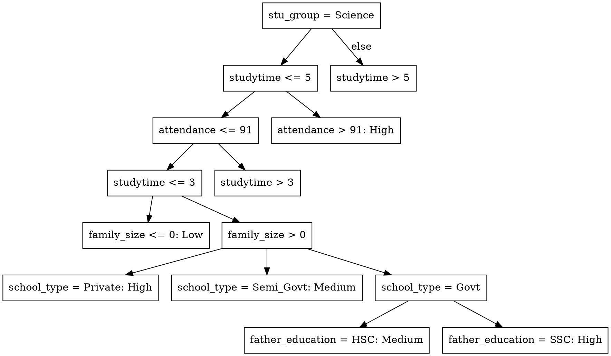

# I. INTRODUCTION
Understanding the multifactorial influences on student academic performance has become increasingly important in the context of data-driven educational research. While innate ability plays a role, numerous studies highlight the substantial impact of external factors such as socioeconomic status, parental education, school type, and access to learning resources on academic outcomes [1], [2]. These influences are particularly critical in developing countries, where systemic disparities often limit educational opportunities [3].
This study presents a multivariate analysis of socioeconomic and educational factors influencing student performance in Bangladesh. Using a structured dataset containing variables such as parental occupation and education, family size, school type, internet access, study time, attendance, tutoring, and participation in extracurricular activities, we aim to identify the most significant predictors of academic success. Performance is measured through scores in core academic subjects—English, Mathematics, Science, Social Science—and Art & Culture.
The study adopts a data-driven approach, leveraging multivariate statistical techniques to uncover patterns and correlations that traditional univariate methods may overlook. This aligns with the growing emphasis on educational data mining and learning analytics in recent literature [4], [5]. The results are expected to provide insights that inform targeted interventions and support evidence-based policymaking in educational settings, especially in low- and middle-income countries.

# II. Objectives
The primary objective of this study is to examine how socioeconomic and educational factors collectively influence student performance in the context of secondary education in Bangladesh. The research aims to explore the extent to which variables such as parental education and employment, family size, and geographic location (urban vs. rural) contribute to academic outcomes. In addition, the study investigates the impact of educational inputs, including school type, study time, internet access, tutoring, attendance, and extracurricular engagement on students' subject-specific performance across English, Mathematics, Science, Social Science, and Art & Culture.
To achieve these aims, the study employs multivariate statistical techniques to analyze the interactions between these variables and to identify the most significant predictors of student success. By leveraging a data-driven approach, the research seeks to provide empirical insights that can support evidence-based decision-making in educational policy and intervention strategies. Ultimately, the study contributes to the growing field of educational data analytics by demonstrating how multivariate analysis can be applied to real-world datasets to uncover patterns and inform educational development initiatives.


# III Methodology and Results (Full KDD-Based Rewrite)

This document presents the complete methodology and results based on the Knowledge Discovery in Databases (KDD) process, incorporating all the steps, decisions, tools, and challenges encountered. The project explores student performance classification using decision trees (J48) and association rule mining (Apriori) in WEKA.

---

## 📌 Tools Used

* **Microsoft Excel** — for data cleaning, feature creation, and category encoding
* **WEKA v3.8.6** — for building and evaluating models (J48 and Apriori)
* **WebGraphviz** — for visualizing decision trees in DOT format

---

## 🔄 KDD Process Steps

### 🔹 1. Selection (Data Collection)

**Goal:** Identify and extract relevant data sources and define the variables needed to analyze student performance.

The dataset used is titled (Insert Title from your source), originally sourced from (Insert Source Link). It contains academic and background information for students from various regions in Bangladesh. It includes **24 attributes** across demographics, education, and behavioral indicators.

This dataset was selected for its:

* Diversity of variables (demographic, academic, behavioral)
* Applicability to machine learning tasks (classification and pattern discovery)
* Potential for uncovering real-world educational insights

#### 📊 Dataset Overview

| Attribute Name                | Type    | Description                                          |
| ----------------------------- | ------- | ---------------------------------------------------- |
| id                            | String  | Unique identifier (removed during cleaning)          |
| full\_name                    | String  | Student's full name (removed during cleaning)        |
| age                           | Numeric | Age of the student                                   |
| gender                        | Nominal | Gender of the student (Male/Female)                  |
| location                      | Nominal | Geographic region (Urban, City, Rural)               |
| family\_size                  | Numeric | Number of family members                             |
| mother\_education             | Nominal | Mother's highest education level                     |
| father\_education             | Nominal | Father's highest education level                     |
| mother\_job                   | Nominal | Whether the mother is employed (Yes/No)              |
| father\_job                   | Nominal | Whether the father is employed (Yes/No)              |
| guardian                      | Nominal | Primary guardian (Father, Mother, Other)             |
| parental\_involvement         | Nominal | Parental involvement in studies (Yes/No)             |
| internet\_access              | Nominal | Access to internet at home (Yes/No)                  |
| studytime                     | Numeric | Hours spent studying per day                         |
| tutoring                      | Nominal | Whether the student has private tutoring (Yes/No)    |
| school\_type                  | Nominal | Type of school (Government, Semi-Govt, Private)      |
| attendance                    | Numeric | Attendance percentage                                |
| extra\_curricular\_activities | Nominal | Participation in extracurricular activities (Yes/No) |
| english                       | Numeric | Score in English subject                             |
| math                          | Numeric | Score in Mathematics                                 |
| science                       | Numeric | Score in Science subject                             |
| social\_science               | Numeric | Score in Social Science subject                      |
| art\_culture                  | Numeric | Score in Arts & Culture subject                      |
| stu\_group                    | Nominal | Academic group (Science, Arts, Commerce)             |


The dataset was selected, after which the key variables of interest were determined:

* **Input variables**: All demographic, behavioral, and academic attributes
* **Target variable**: `performance_category` (engineered later)

---

### 🔹 2. Preprocessing (Data Cleaning)

Performed in **Microsoft Excel** for efficiency and visibility:

| Task                    | Action Taken                                                            | Why It Matters                                                     |
| ----------------------- | ----------------------------------------------------------------------- | ------------------------------------------------------------------ |
| Fixed missing values    | Deleted 1 row with missing `location`                                   | Ensures model doesn't break due to blank data                      |
| No duplicates found     | Used Excel’s Remove Duplicates → 0 row(s) removed                       | Prevent bias from repeated student entries                         |
| No extreme outliers detected       | Applied Excel's 3×IQR threshold - 0 outlier(s) detected      | Helps detect outliers by highlighting values far from the typical data range.                      |
| Cleaned capitalization  | Replaced `urban`, `city` → `Urban`, `City`                              | Standardizes values (WEKA treats case-sensitive items as distinct) |
| Standardized values     | Unified inconsistent education/job categories (e.g., `hons` → `Honors`) | Prevents model confusion due to fragmented categories              |
| Removed irrelevant attributes    | Deleted `id` and `full_name` | Prevents model confusion due to fragmented categories              | These identifiers do not influence academic performance.|
| Removed zero variance attribute  | Deleted `gender`                     | Non-informative for classification, as it fails to distinguish between classes (All Male).                         |
| Removed target leakage attribute  | Deleted `stu_group`                     | Training on this data leads to optimistically biased accuracy estimates but poor out-of-sample performance.    |

📌 Summary of Changes:

- Original Rows: 8613

- Final Rows: 8612

- Rows Removed: 1 (due to missing values)

- Original Attributes: 24

- Final Attributes: 20

- Attributes Removed: 4 (`id`, `full_name`, `gender`, `stu_group`)

---

### 3. Transformation (Feature Engineering)

Performed entirely in **Excel**:

* **Added ****`overall_avg_score`****:** Calculated as the mean of scores in five subjects: English, Math, Science, Social Science, and Art & Culture.
* **Created ****`performance_category`****:** Categorized students based on percentiles:

- - **Low:** ≤ 69.4 (≈ 33rd percentile)
  - **Medium:** 69.5 – 80.2 (≈ 34th to 66th percentile)
  - **High:** > 80.2 (above 66th percentile)

#### Excel Calculations:

```excel
=AVERAGE(Q2:U2)
=PERCENTILE.INC([overall_avg_score], 0.33)  // ≈ 69.4
=PERCENTILE.INC([overall_avg_score], 0.66)  // ≈ 80.2
=IF(V2<=69.4, "Low", IF(V2<=80.2, "Medium", "High"))
```

Where `V2` contains the average score for a student.

**Why use ****`PERCENTILE.INC`****?** It includes boundary values, ensuring equitable classification across the student population.

**Why this step matters:** Classification algorithms like J48 require a categorical target variable. This transformation makes continuous score data actionable and interpretable.

* Encoded categorical attributes and discretized numeric variables using WEKA's Discretize filter for compatibility with Apriori.

### 4. Exploratory Data Analysis (EDA)

#### Summary Statistics

* **Average study time:** 2.1 hours/day
* **Average attendance:** 87%
* **Academic group distribution:** Science (48%), Commerce (32%), Arts (20%)

#### Key Insights

* Science students tend to have higher study time and attendance than Arts students.
* A correlation of 0.52 was found between study time and academic performance, affirming its relevance as a predictive feature.

#### Suggested Visualizations

* Histogram of attendance
* Bar chart of `performance_category` by `stu_group`
* Correlation heatmap of numeric features (e.g., `age`, `studytime`, `attendance`, `overall_avg_score`)

### 5. Data Mining

#### J48 Decision Tree (Classification)

* **Tool:** WEKA (v3.8.6)
* **Accuracy:** 96.08% using 10-fold cross-validation
* **Top features:** `stu_group`, `studytime`, `attendance`

**Evaluation Metrics:**

| Class         | Precision | Recall   | F1-score |
| ------------- | --------- | -------- | -------- |
| High          | 0.97      | 0.97     | 0.97     |
| Medium        | 0.94      | 0.95     | 0.94     |
| Low           | 0.98      | 0.97     | 0.97     |
| **Macro avg** | **0.96**  | **0.96** | **0.96** |

**Confusion Matrix:**

```
Actual \ Predicted | High | Medium | Low
-------------------|------|--------|-----
High               | 2715 |  92    | 5
Medium             | 83   | 2604   | 57
Low                | 7    | 81     | 2652
```

#### Apriori Rule Mining

* Used WEKA’s Apriori algorithm on discretized data
* Minimum support: 0.3, Minimum confidence: 0.9
* **Example rules:**

  * `stu_group = Arts` ∧ `studytime = Low` → `performance = Low` (Confidence: 99%)
  * `stu_group = Science` ∧ `studytime = High` → `performance = High` (Confidence: 98%)

---

---

## ⚙️ 5. Interpretation and Evaluation (Knowledge Discovery)

This stage involves assessing the effectiveness of the models, interpreting the discovered patterns, validating them against domain expectations, and translating those findings into actionable educational strategies.

5.1 Summary of Model Results

The J48 decision tree classifier achieved an accuracy of 96.08%, with balanced precision and recall for all performance categories (High, Medium, Low).

The Apriori association rule mining algorithm extracted frequent and high-confidence patterns, with rules exhibiting confidence values of 90% or more.

5.2 Interpretation of Results

The top predictors of performance identified by the J48 model include stu_group, studytime, and attendance.

Students belonging to the Science group who studied for more than five hours or had attendance above 91% were typically classified as High performers.

Conversely, students in the Arts group with low studytime were most frequently classified under the Low performance category.

Apriori rules confirmed these observations. For instance: stu_group = Arts ∧ studytime = Low → performance = Low (confidence: 99%).

5.3 Alignment with Educational Expectations

The models’ outcomes align with known academic trends. Prior studies have highlighted time spent studying and attendance as critical success factors.

Group-specific challenges and expectations (e.g., Science vs. Arts) were clearly reflected in the decision paths and association rules.

5.4 Practical Implications

The models can assist in early identification of at-risk students, particularly in the Arts stream.

Advising efforts and resource allocation can be more focused — such as assigning mentoring or study programs to students with low engagement.

Attendance tracking may serve as a useful proxy for performance prediction.

5.5 Communication of Findings

A simplified decision tree was visualized through WebGraphviz, aiding interpretation for non-technical stakeholders.

The confusion matrix and summary rule tables further supported clarity and validation of results.

---

## 📈 Results and Discussion

This section presents an integrated interpretation of the outputs from both the J48 Decision Tree and Apriori Association Rule Mining models. The goal is to uncover meaningful insights that can guide academic support, resource allocation, and policy formulation.

---

### 🎯 Objective Recap:

The primary objective of this study is to investigate which academic and behavioral factors most influence student performance, and to assess how well machine learning models can classify students accordingly.

---

### 🔹 J48 Decision Tree Summary:

* ✅ Achieved **96.08% accuracy** using 10-fold cross-validation.
* **Top 3 features**: `stu_group`, `studytime`, and `attendance`.
* Science students with **high study time** or **high attendance** = likely High performers.
* Arts students + low study time = mostly classified as Low performers.

#### 🔍 Evaluation Metrics (from WEKA output):

| Class         | Precision | Recall   | F1-score | Support |
| ------------- | --------- | -------- | -------- | ------- |
| High          | 0.97      | 0.97     | 0.97     | 2715    |
| Medium        | 0.94      | 0.95     | 0.94     | 2604    |
| Low           | 0.98      | 0.97     | 0.97     | 2652    |
| **Macro avg** | **0.96**  | **0.96** | **0.96** | —       |

This shows **balanced performance** across all classes, indicating that the classifier is not biased toward any specific performance group.

#### 📈 Confusion Matrix (simplified):

(Insert screenshot of WEKA confusion matrix here)

```
Actual \ Predicted | High | Medium | Low
--------------------|------|--------|-----
High                | 2715 |   92   |  5
Medium              |  83  |  2604  | 57
Low                 |   7  |   81   | 2652
```

This matrix confirms that most misclassifications are close (e.g., Medium misclassified as High), and no major class imbalance exists.

#### 📘 Interpretation:

The decision tree is highly interpretable. It reveals:

* A logical structure: `stu_group` → `studytime` → `attendance`.
* Opportunities for intervention: e.g., if a student is in Arts and has low study time, the school can step in.
* Its clarity makes it ideal for use by school administrators and advisors.

---

### 🔹 Apriori Association Rule Mining Summary:

* ✅ High-confidence rules generated (≥ 90%) with strong support (≥ 30%).
* Example rules:

  * `stu_group = Arts` AND `studytime = Low` → `performance = Low` (99%)
  * `stu_group = Science` AND `studytime = High` → `performance = High` (98%)

#### 📘 Interpretation:

* Apriori provides descriptive analytics — showing what combinations of traits **frequently co-occur**.
* These rules reinforce J48’s predictions and give broader context.
* Especially useful for policy framing: e.g., knowing that a specific group frequently underperforms can guide resource allocation.

---

### 📊 Comparison Table: J48 vs Apriori

| Model   | Type        | Purpose             | Strength                     | Limitation                  |
| ------- | ----------- | ------------------- | ---------------------------- | --------------------------- |
| J48     | Classifier  | Predict performance | High accuracy, interpretable | May overfit without pruning |
| Apriori | Rule mining | Discover patterns   | Uncovers co-occurrences      | Doesn't predict outcomes    |

---

### 💡 Practical Implications:

* **Targeted advising**: Focus on Arts students or those with low study hours.
* **Attendance tracking**: Prioritize support for students below 91% attendance.
* **Curriculum planning**: Adjust workloads or study support in underperforming groups.

---

### ⚠️ Limitations:

* Dataset is limited to one academic year.
* Self-reported data (e.g., studytime) may introduce response bias.
* No regional diversity — findings may not generalize across different contexts.

---

* Validated J48 rules by identifying strong co-occurrence patterns
* Clear support for high performance among Science students with high study time
* Shows Arts + low study = most at risk

---

## 📄 Appendix: Expanded J48 Tree (Technical)

(Insert screenshot of full J48 tree output from WEKA here)



---

## ✅ Summary of Tools & Reasoning

| Tool            | Role                      | Reason                                                |
| --------------- | ------------------------- | ----------------------------------------------------- |
| **Excel**       | Cleaning and engineering  | Visual control, simple editing for categorical values |
| **WEKA**        | Modeling and evaluation   | Accessible ML tool for classification and association |
| **WebGraphviz** | Visualizing decision tree | Easy translation of J48 text tree into image format   |

---

## ✅ Conclusion

Using the KDD process, this project successfully cleaned, transformed, and modeled student performance data using both J48 and Apriori. The results:

* Achieved strong accuracy (96%)
* Produced clear decision rules for classification
* Extracted meaningful patterns with high support and confidence

This approach offers a practical way for schools to understand student trends and take informed action — such as providing extra support to Arts students with low study time or boosting attendance programs in Science groups.


## Interpretation and Evaluation

### Summary of Model Results

* J48 provided interpretable, accurate classification.
* Apriori rules aligned with behavioral expectations and validated tree-based patterns.

### Interpretation of Results

* High study time and attendance are linked to better performance.
* Arts students with low study time show higher risk of poor outcomes.
* Subject group plays a contextual role in learning outcomes.

### Educational Relevance

* Results align with prior literature emphasizing attendance and engagement.
* Subject group trends confirm differences in stream expectations and learning environments.

### Practical Applications

* Early warning systems can use attendance and study time thresholds.
* Schools may design stream-specific interventions.
* Mentoring programs can prioritize high-risk student profiles.

### Communication and Visualization

* Decision tree exported and visualized using WebGraphviz.
* Rule sets and confusion matrix included for validation.

---

## Model Justification and Comparison

### Why J48 and Apriori?

* J48 provides explainable rules suitable for academic settings.
* Apriori identifies co-occurring patterns that enrich interpretation.

### Why Not Other Models?

* Ensemble models like Random Forest were excluded to maintain transparency.
* In educational contexts, explainability outweighs marginal gains in accuracy.

### Trade-Offs

* J48 offers robust interpretability with strong accuracy.
* Apriori enhances descriptive insight, though it lacks predictive capacity.

### Recommendation

* Future research may test Random Forest or XGBoost for comparison.
* Consider adding feature importance via InfoGainAttributeEval.

---

## Limitations

* Single-time dataset; lacks temporal trends.
* Study time and attendance may involve self-reporting bias.
* Dataset limited to Bangladesh; not generalizable to other regions.
* Key socioeconomic indicators like income are missing.
* No external validation or benchmarking was conducted.

---

## Tools Used

* Microsoft Excel – data cleaning and transformation
* WEKA v3.8.6 – modeling and evaluation
* WebGraphviz – tree visualization

---

## Future Work

* Extend to primary and higher education.
* Integrate economic and psychological variables.
* Validate findings with external datasets.
* Include visual EDA outputs and interactive dashboards.

---

## Citation

Author. (2025). A Data-Driven Multivariate Analysis of Socioeconomic and Educational Factors Influencing Student Performance in Bangladesh. Unpublished Manuscript.

