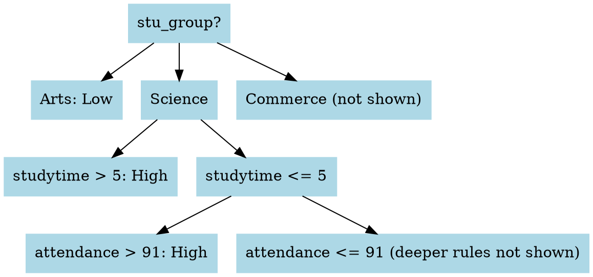
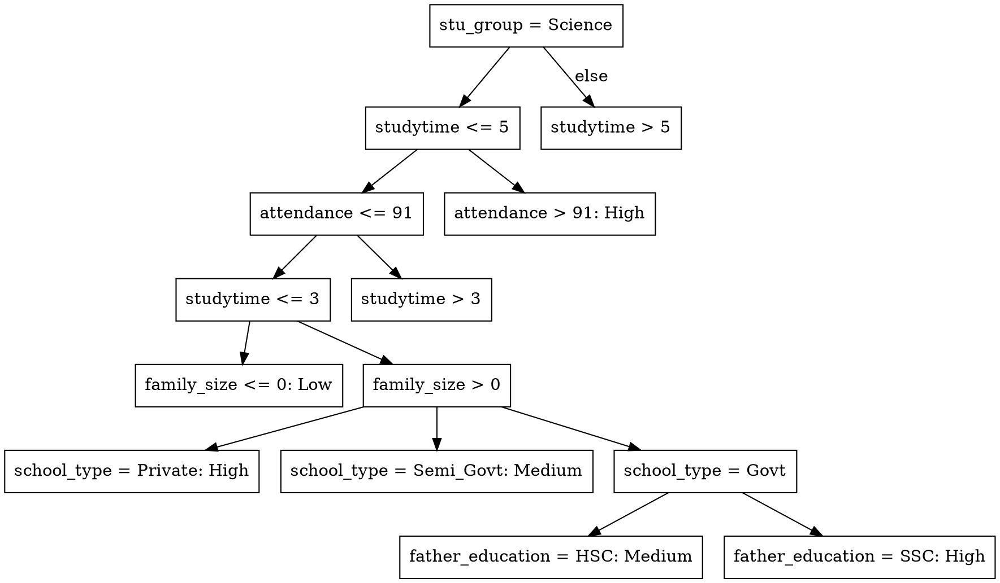

# 📘 Methodology and Results (README Format)

This document outlines the full step-by-step process for analyzing student performance using WEKA and Excel. It follows the Knowledge Discovery in Databases (KDD) process, from data preparation to modeling and discussion.

---

## 📌 Tools Used

* **Microsoft Excel** — for data cleaning, transformation, and feature engineering
* **WEKA v3.8.6** — for classification (J48 decision tree) and association rule mining (Apriori)
* **WebGraphviz** — for visualizing the decision tree

---

## 🔍 Step-by-Step Process

### 🔹 1. Initial Review (Excel)

**Goal:** Understand the raw dataset structure

* Opened `bd_students_per_uncleaned.csv` in Excel
* Inspected for formatting issues, irrelevant columns, and text inconsistencies
* Identified 24 attributes including scores and socio-demographics

### 🔹 2. Data Cleaning (Excel)

| Task                    | Action Taken                                           | Why It Matters                                     |
| ----------------------- | ------------------------------------------------------ | -------------------------------------------------- |
| Removed columns         | Deleted `id` and `full_name`                           | Irrelevant for analysis                            |
| Removed duplicates      | Excel's `Remove Duplicates` → 315 rows removed         | Prevent bias due to repeated data                  |
| Fixed missing value     | 1 row with missing `location` deleted                  | Incomplete data affects model reliability          |
| Fixed capitalization    | Replaced `urban`/`city` with `Urban`/`City`            | Prevents WEKA from reading duplicates as different |
| Standardized categories | Cleaned inconsistent strings (e.g., `hons` → `Honors`) | Ensures consistency                                |
| Fixed attribute names   | Renamed corrupted headers (e.g., `Ã¥ge` → `age`)       | Prevents WEKA errors                               |

### 🔹 3. Feature Engineering (Excel)

**Goal:** Create new attributes that summarize academic performance in a way that models like J48 and Apriori can understand and use effectively.

* Created `overall_avg_score`: the average of 5 subject scores. This gives a single, meaningful number representing a student's academic performance.
* Created `performance_category`: a simplified label (Low/Medium/High) based on percentile ranks.

  **Why we needed it:** Machine learning classifiers like J48 work best when the outcome variable (the class) is **categorical**. Since average score is numeric, we transformed it into categories so we could group students and make the model easier to interpret.

  **Why we used `PERCENTILE.INC` instead of `PERCENTILE.INC`:** Since we wanted to ensure that no students were excluded from the boundary values (e.g., lowest or highest), and because Excel includes more flexible handling of the full data range, we chose `PERCENTILE.INC` to calculate thresholds. This is especially helpful when you want slightly more inclusive boundaries in educational datasets.

  **How we did it in Excel:**

  * Calculated percentiles:
    \=PERCENTILE.EXC(X2\:X8297, 0.33)  // returns 69.4
    \=PERCENTILE.EXC(X2\:X8297, 0.66)  // returns 80.2

    ```
    ```
  * Used those thresholds to assign categories:

    ```excel
    =IF(X2<=69.4, "Low", IF(X2<=80.2, "Medium", "High"))
    ```

    Where `X2` is the overall average scoreexcel
    \=PERCENTILE.EXC(X2\:X8297, 0.33)  // returns 69.4
    \=PERCENTILE.EXC(X2\:X8297, 0.66)  // returns 80.2

    ```
    ```
  * Applied this formula for classification:

    ```excel
    =IF(X2<=69.4, "Low", IF(X2<=80.2, "Medium", "High"))
    ```

    Where `X2` is the cell containing the overall average score

### 🔹 4. Dataset Finalization (Excel)

* Ensured all attributes were correctly labeled and cleaned
* Saved as `cleaned_bd_students.csv`

---

## ⚙️ WEKA Analysis

**Goal:** Perform classification and pattern discovery using clean and structured data. WEKA is a machine learning platform that provides accessible tools for running algorithms such as decision trees and association rule mining without coding. This step covers importing the data, running models, and interpreting the outputs.

### 🔹 5. Load and Setup

**Purpose:** Load the cleaned dataset into WEKA and specify the target variable.

**Explanation:** Setting the `performance_category` as the class attribute tells WEKA what we are trying to predict. This is required before running any classification algorithm. WEKA uses this column to measure how well different input features explain or predict it.

* Opened `cleaned_bd_students.csv` in WEKA → **Preprocess tab**
* Set `performance_category` as the **class attribute**

### 🔹 6. Discretization (for Apriori only)

**Purpose:** Convert numeric attributes into categories (Low, Medium, High) so Apriori can understand and process them.

**Explanation:** Apriori can only process categorical (nominal) values. So we used WEKA’s Discretize filter to divide continuous attributes like `studytime`, `attendance`, and `age` into 3 bins. This allowed Apriori to discover meaningful patterns using these newly categorized versions.

* Applied: `Filters → Unsupervised → Attribute → Discretize`
* Transformed numerical data into 3 bins (Low, Medium, High)

### 🔹 7. J48 Decision Tree

**Purpose:** Build a model that classifies students into performance categories using decision rules.

**Explanation:** J48 is an implementation of the C4.5 decision tree algorithm. It splits data based on the most informative attributes first. We used 10-fold cross-validation to make the model more reliable, where the dataset is split into 10 parts — 9 for training and 1 for testing — repeated 10 times.

* Classifier: `trees → J48`
* Evaluation method: `10-fold cross-validation`
* **Accuracy:** ✅ **96.08%**

#### 🌳 Key Rules Found:

* `stu_group = Science` AND `studytime > 5` → High
* `stu_group = Arts` AND `studytime <= 3.5` → Low
* `attendance > 91` boosts outcomes even with lower studytime

**Explanation of Key Rules:**

* `stu_group = Science`: This means the student is in the Science academic track. Students in Science generally perform better.
* `studytime <= 5`: If a student studies 5 hours or less per day, it may not be enough for high performance.
* `attendance <= 91`: If a student's attendance is 91% or lower, they may miss important lessons and fall behind.

These rules form the first 2–3 levels of the decision tree, which cover the broadest and most impactful patterns. That’s why they were selected for simplified interpretation.

### 🔹 8. Apriori Association Rule Mining

**Purpose:** Discover frequent and confident patterns in the dataset to explain common traits of high or low performing students.

**Explanation:** Apriori finds relationships like "If a student is in the Arts group and studies less, they likely perform poorly." These rules are not used to predict outcomes, but to understand **what patterns exist**. We adjusted support and confidence to limit rules to only those with strong statistical backing.

* Menu: `Associations → Apriori`
* Settings: support ≥ 0.3, confidence ≥ 0.9
* **Top Rules:**

  * `stu_group = Arts` AND `studytime = Low` → `performance = Low` (99% confidence)
  * `stu_group = Science` AND `studytime = High` → `performance = High` (98–99% confidence)

---

## 📈 Results and Discussion

### 📌 Decision Tree (J48)

The J48 decision tree achieved high accuracy (96.08%) and revealed clear top-level decision factors:

* Academic track (`stu_group`)
* Daily study time
* Attendance

These variables alone allowed the tree to classify students accurately into Low, Medium, or High performers.

**Why the Top 3 Levels Matter:**
We chose to focus on the top three levels of the decision tree because:

* ✅ **They capture broad patterns**: These first decisions (like group and study time) already separate students into high, medium, or low performers in large chunks.
* ✅ **They are easy to understand**: Teachers and school staff can make quick interventions using these clear rules (e.g., students in Arts with low study time likely need help).
* ✅ **Deeper levels become too specific**: Further splits involve combinations like “guardian = father AND mother\_job = Yes,” which only apply to very few students — making them less useful for general school policies.

This simplification aligns with your study's goal: to identify **clear, actionable insights** rather than overfitting with complex rules.

**🔍 Visualizing the Top 3 Levels:**
To keep the tree simple and focused on general trends, we visualized only the top three splits using WebGraphviz. Here's the simplified structure:



### 🧠 How to Read This Tree

This decision tree shows how a student's **academic group**, **study time**, and **attendance** relate to their predicted performance.

#### 🔹 Step 1: Start with `stu_group?`

* If the student is in **Arts** → they are predicted as **Low performer**
* If in **Science** → check study time next
* If in **Commerce** → not shown in this simplified tree

#### 🔹 Step 2: `studytime`

For Science students:

* If they study **more than 5 hours/day** → predicted **High performer**
* If they study **5 hours or less** → check attendance

#### 🔹 Step 3: `attendance`

For Science students who study ≤ 5 hours:

* If attendance is **above 91%** → predicted **High performer**
* If attendance is **91% or below** → further rules apply (not shown)

#### ✅ Summary

This tree shows that:

* Arts students generally struggle
* Science students perform well if they study enough or attend class regularly

This helps educators quickly identify students who may need support or who are likely to succeed.

This simplified view is easy to understand and explains the major routes a student might take based on just a few key attributes.

### 📌 Apriori Complement

Apriori helped validate and **complement** the J48 tree by showing **frequent, high-confidence patterns**:

* Unlike J48’s structure, Apriori shows general trends across the entire dataset
* It confirmed key combinations that commonly lead to poor or good performance

Together:

* **J48** = how to classify performance
* **Apriori** = what combinations lead to certain outcomes

This dual method supports your objective of understanding student performance **and offering practical guidance** to schools.

---

## 📄 Appendix: Expanded J48 Decision Tree (DOT Format)

For deeper analysis, here's the more detailed version of the decision tree that goes beyond the top 3 levels. This format includes more refined conditions and is best used for technical reference or internal review.



To visualize this tree, paste it into [https://webgraphviz.com](https://webgraphviz.com).

---

## ✅ Summary of Tools & Why We Used Them

| Tool            | Role                        | Reason                                            |
| --------------- | --------------------------- | ------------------------------------------------- |
| **Excel**       | Cleaning and engineering    | Fast, visual control for string/text-based fixes  |
| **WEKA**        | Modeling and pattern mining | Accessible tool with strong classifiers and rules |
| **WebGraphviz** | Decision tree visualization | Converts WEKA output into readable tree diagrams  |

---

## ✅ Conclusion

By combining J48 and Apriori, we gained both **predictive models** and **descriptive insights**. These results can support schools in identifying at-risk students and applying interventions based on:

* Group (Arts, Science, Commerce)
* Study habits
* Attendance and family background

The approach followed here is explainable, data-driven, and practical — suitable for educational settings and easy to replicate using free tools.

---
